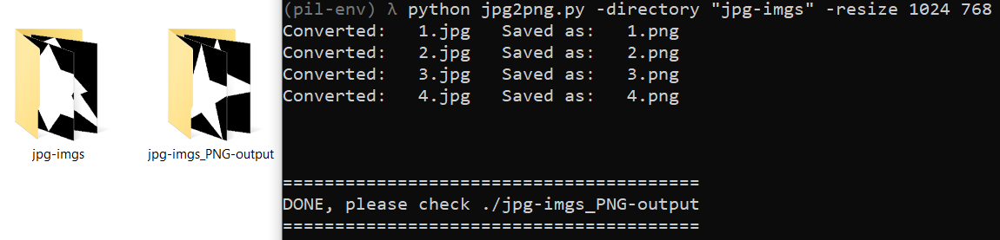

# jpg2png




Código en **Python3** que usa [PIL](https://github.com/python-pillow/Pillow) para convertir **y redimensionar** todas las imágenes JPG de una carpeta (*nombre_carpeta*) a imágenes PNG. 
Estas imágenes se guardan en una carpeta con terminación _PNG-output (*nombre_carpeta_PNG-output*).

Además a las imágenes PNG se les agrega un texto como metadato tipo [Image.info](https://pillow.readthedocs.io/en/stable/reference/Image.html#PIL.Image.Image.info). En este caso es "Imagen convertida y redimensionada con codigo obtenido de github.com/JuanMX/jpg2png".

## Decargar el proyecto, crear un entorno virtual e instalar las dependencias

Abrir una terminal de [git](https://git-scm.com/).

Ejecutar

```
git clone https://github.com/JuanMX/jpg2png.git
```

Cambiar al directorio del proyecto clonado.

```
cd jpg2png
```

Se recomienda hacer un entorno virtual de Python3

```
python -m venv pil-env
```

Activar el entorno virtual

En **Windows**

```
pil-env\Scripts\activate.bat
```

En **Linux**

```
source pil-env/bin/activate
```

Actualizar `pip`

```
python -m pip install --upgrade pip
```

Instalar las dependencias necesarias usando el archivo `requirements.txt`

```
python -m pip install -r requirements.txt
```

## Usar el código fuente

`jpg2png.py` y la carpeta `imgs` con imágenes JPG deben estar en el mismo directorio, al mismo nivel. Después ejecutar:

```
python jpg2png.py -directory "imgs" -resize 1024 768
```

Para el caso en que tenga Python2 y Python3 instalado debe ejecutar:

```
python3 jpg2png.py -directory "imgs" -resize 1024 768
```

donde:

* `imgs` es la carpeta que tiene las imágenes JPG.
* `1024 768` es la redimensión de la imágenes a 1024px de ancho y 768px de alto.

El resultado es una carpeta `imgs_PNG-output` con las imágenes PNG de tamaño 1024x768.

<br>
<hr>
<hr>
<hr>
<br>

# jpg2png

**Python3** source code. It uses [PIL](https://github.com/python-pillow/Pillow) in order to convert **and resize** all JPG images from certain directory (*directory_name*).
The output PNG images are stored in other directory with *_PNG-output* termination (*directory_name_PNG-output*).

Also a text metadata type [Image.info](https://pillow.readthedocs.io/en/stable/reference/Image.html#PIL.Image.Image.info) is appended to the output PNG images. In this case is "Imagen convertida y redimensionada con codigo obtenido de github.com/JuanMX/jpg2png".

## Download the project, create a virtual enviroment and install the dependencies

Open a [git](https://git-scm.com/) terminal.

Execute

```
git clone https://github.com/JuanMX/jpg2png.git
```

Change to the cloned project directory

```
cd jpg2png
```

It is recommended to make a Python3 virtual environment.

```
python -m venv pil-env
```

Activate the virtual environment.

In **Windows**

```
pil-env\Scripts\activate.bat
```

In **Linux**

```
source pil-env/bin/activate
```

Update `pip`

```
python -m pip install --upgrade pip
```

Install the necessary dependencies via the `requirements.txt` file.

```
python -m pip install -r requirements.txt
```

## Use the source code

`jpg2png.py` and the `imgs` folder with the JPG images need to be in the same directory, at the same level. Then execute:

```
python jpg2png.py -directory "imgs" -resize 1024 768
```

For the case with the both versions of Python instaled (Python2 and Python3), execute:

```
python3 jpg2png.py -directory "imgs" -resize 1024 768
```

Where:

* `imgs` is the directory with the JPG images.
* `1024 768` is the resizing: 1024px width and 768px height per image.

The ouput is a folder `imgs_PNG-output` with PNG images of 1024x768 size.